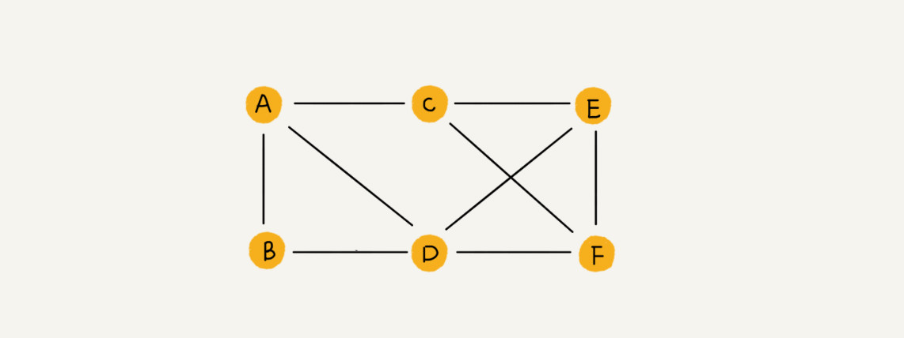

# 图

## 图的基本概念

无向完全图：在无向图中，如果任意两个顶点之间都存在边，则称该图为无向完全图。含有 n 个顶点的无向完全图有 **n(n-1)/2** 条边。

有向完全图：在有向图中，如果任意两个顶点之间都存在方向相反的两条弧，则称该图为有向完全图。含有 n 个顶点的有向完全图有 **n(n-1)** 条有向边。

子图：设有两个图 G=(V,E) 和 G’=(V’,E’)，若 V’是 V 的子集，且 E’是 E 的子集，则称 G’是 G 的子图。若有满足 V (G’)=V (G) 的子图 G’，则为 G 的生成子图。

连通、连通图和连通分量（无向图）：在无向图中，若从顶点 v 到顶点 w 有路径存在，则称 v 和 w 是连通的。若图 G 中任意两个顶点都是连通的，则称图 G 为连通图，否则称为非连通图。无向图中的极大连通子图称为连通分量。如果一个图有 n 个顶点，并且有小于 n-1 条边，则此图必是非连通图。

强连通图、强连通分量（有向图）：在有向图中，若从顶点 v 到顶点 w 和从顶点 w 到顶点 v 之间都有路径，则称这两个顶点是强连通的。若图中任何一对顶点都是强连通的，则称该图为强连通图。有向图中的极大强连通子图称为强连通分量。

生成树、生成森林：连通图的生成树是包含图中全部顶点的一个极小连通子图。若图中顶点数为 n，则它的生成树含有 n-1 条边。对于生成树而言，若砍去它的一条边，则它会变成非连通图，若加上一条边则会形成一个回路。

对于无向图，顶点 v 的度是指依附于该顶点的边的条数，记为 TD (v)。在具有 n 个顶点 e 条边的无向图中，全部顶点的度之和为 2e，即无向图的全部顶点的度之和等于边数的两倍。

对于有向图，顶点 v 的度分为入度和出度，入度记为 ID (v)，出度记为 OD (v)。顶点 v 的度等于其入度和出度之和，即 TD (v)=ID (v)+OD (v)。在具有 n 个顶点 e 条边的有向图中，有向图的全部顶点的入度之和与出度之和相等并且等于边数。

带权图也称为网。

稠密图：边数很多；稀疏图：边数很少。一般当图 G 满足 | E|<|V|*log|V | 时，可以将 G 看成是稀疏图。

路径：顶点序列；路径长度：路径上边的数目。第一个顶点和最后一个顶点相同的路径称为回路或环。如果一个图有 n 个顶点，并且有大于 n-1 条边，则此图一定有环。

在路径序列中，顶点不重复出现的路径称为简单路径。除第一个顶点和最后一个顶点之外，其余顶点不重复出现的回路称为简单回路。

有一个顶点的入度为 0，其余顶点的入度均为 1 的有向图称为有向树。

## 图的存储及基本操作

### 1. 邻接矩阵

用一个一维数组存储图中顶点的信息，用一个二维数组存储图中边的信息（即各顶点之间的邻接关系），存储顶点之间邻接关系的二维数组称为邻接矩阵。

1. 无向图的邻接矩阵是对称矩阵（并且唯一），在实际存储邻接矩阵时只需存储上（或下）三角矩阵的元素即可，对规模特大的邻接矩阵可采用压缩存储。
2. 邻接矩阵表示法的空间复杂度为 O (n2)，其中 n 为图的顶点数 | V|。
3. 对于无向图，邻接矩阵的第 i 行（或第 i 列）非零元素（或非∞元素）的个数正好是第 i 个顶点的度。
4. 对于有向图，邻接矩阵的第 i 行（或第 i 列）非零元素（或非∞元素）的个数正好是第 i 个顶点的出度（或入度）。
5. 容易确定顶点之间是否有边相连，但难以确定图中有多少条边。
6. 稠密图适合使用邻接矩阵的存储表示。

---

### 2. 邻接表

对图 G 中的每个顶点 vi 建立一个单链表，第 i 个单链表中的结点表示依附于顶点 vi 的边（对于有向图则是以顶点 vi 为尾的弧），这个单链表就称为顶点 vi 的边表（对于有向图则称为出边表）。边表的头指针和顶点的数据信息采用顺序存储（称为顶点表），所以在邻接表中存在两种结点：顶点表结点和边表结点。
顶点表结点由顶点域（data）和指向第一条邻接边的指针（firstarc）构成，边表（邻接表）结点由邻接点域（adjvex）和指向下一条邻接边的指针域（nextarc）构成。

1. 如果 G 为无向图，则所需的存储空间为 O (|V|+2|E|)；如果 G 为有向图，则所需的存储空间为 O (|V|+|E|)
2. **对于稀疏图，采用邻接表表示将极大地节省存储空间**。
3. **容易找出顶点的所有邻边，但难以确定两个顶点之间是否存在边**。
4. **图的邻接表表示并不唯一**。

---

### 3. 十字链表

是**有向图**的一种**链式**存储结构。
既容易找到 vi 为尾的弧，也容易找到 vi 为头的弧，因而容易求得顶点的出度和入度。
图的十字链表表示是不唯一的，但一个十字链表表示确定的一个图。

---

### 4. **邻接多重表**

是**无向图**的另一种**链式**存储结构。

## 图的遍历

### 1. 广度优先搜索（BFS）

不是一个递归的算法，必须借助一个辅助**队列**，以记忆正在访问的顶点的下一层顶点。
类似的思想还应用于 Dijkstra 单源最短路径算法和 Prim 最小生成树算法。
**空间复杂度为 O (|V|)；采用邻接表存储方式时，时间复杂度为 O (|V|+|E|)；采用邻接矩阵存储方式时，时间复杂度为 O (|V|^2)**。

广度优先生成树：一给定图的邻接矩阵存储表示是唯一的，故其广度优先生成树也是唯一的，但由于邻接表存储表示不唯一，故其广度优先生成树也是不唯一的。

对于一个非连通无向图 G，采用深度优先遍历访问所有顶点，**调用 DFS 的次数正好等于连通分量数**。

---

### 2. 深度优先搜索（DFS）

对于同样一个图，基于邻接矩阵的遍历所得到的 DFS 序列和 BFS 序列是唯一的，基于邻接表的遍历所得到的 DFS 序列和 BFS 序列是不唯一的。
**空间复杂度为 O (|V|)；采用邻接表存储方式时，时间复杂度为 O (|V|+|E|)；采用邻接矩阵存储方式时，时间复杂度为 O (|V|^2)**。

## 图的应用

### 1. 最小生成树（MST）

Prim 算法、Kruskal 算法

1. 最小生成树不是唯一的。当图 G 中的各边权值互不相等时，G 的最小生成树是唯一的；若无向连通图 G 的边比顶点树少 1，即 G 本身就是一棵树时，Ｇ的最小生成树就是它本身。
2. 最小生成树的边的权值之和总是唯一的。
3. 最小生成树的边数为顶点数减１。

**Prim 算法的时间复杂度为 O (|V|^2)，不依赖于 | E|，因此它适用于求解边稠密的的图的最小生成树。Kruskal 算法适用于边稀疏而顶点较多的图**。

---

### 2. 最短路径

分为两类：一是单源最短路径：即求图中某一顶点到其他各顶点的最短路径，可通过 Dijkstra 算法求解；二是求每一对顶点间的最短路径，可通过 Floyd-Warshall 算法来求解。
Dijkstra 算法：单源最短路径时间复杂度为 O (|V|^2)。如果边上带有负权值，Dijkstra 算法并不适用。
Floyd 算法的时间复杂度为 O (|V|^3)。Floyd 算法允许图中带负权值的边，但不允许有包含带负权值的边组成的回路。Floyd 算法同样也适用于带权无向图。

---

### 3.  有向无环图（DAG）
**AOV 网**：如果用 DAG 图表示一个工程，其顶点表示活动，用有向边 <Vi,Vj> 表示活动 Vi 必须先于活动 Vj 进行的这样一种关系，则将这种有向图称为顶点表示活动的网络，记为 AOV 网。
**拓扑排序**：由一个有向无环图的顶点组成的序列，当且仅当满足下列条件时，称为该图的一个拓扑排序：

1. 每个顶点出现且只出现一次。
2. 若顶点 A 在序列中排在顶点 B 的前面，则在图中不存在从顶点 B 到顶点 A 的路径。
   每个 DAG 图都有一个或多个拓扑序列。
   对一个 DAG 图进行拓扑排序的算法：
   - 从 DAG 图中选择一个没有前驱的顶点并输出
   - 从图中删除该顶点和所有以它为起点的有向边
   - 重复 1 和 2 直到当前的 DAG 图为空或当前图中不存在无前驱的顶点为止。而后一种情况说明有向图中必然存在环
     **时间复杂度为 O (|V|+|E|)**

若一个有向图具有有序的拓扑排序序列，那么它的邻接矩阵必定为三角矩阵。

**AOE 网**：在带权有向图中，以顶点表示事件，有向边表示活动，边上的权值表示完成该活动的开销，则称这种有向图为用边表示活动的网络，简称为 AOE 网。
1）只有在某顶点所代表的事件发生后，从该顶点出发的各有向边所代表的活动才能开始
2）只有在进入某一顶点的各有向边所代表的活动都已经结束时，该顶点所代表的事件才能发生。
在 AOE 网中，仅有一个入度为 0 的顶点，称为开始顶点（源点），它表示整个工程的开始，仅有一个出度为 0 的顶点，称为结束顶点（汇点），它表示整个工程的结束。
从源点到汇点的所有路径中，具有最大路径长度的路径称为**关键路径**。关键路径上的活动称为关键活动。
完成整个工程的最短时间就是关键路径的长度，也就是关键路径上各活动花费开销的总和。

**事件 vk 的最早发生时间 ve (k)**：指从开始顶点 V 到 Vk 的最长路径长度。事件的最早发生时间决定了所有从 Vk 开始的活动能够开工的最早时间。（从前往后计算）
**事件 vk 的最迟发生时间 vl (k)**：指在不推迟整个工程完成的前提下，即保证它所指向的事件 vi 在 ve (i) 时刻能够发生时，该事件最迟必须发生的事件。（从后往前计算）
**活动 ai 的最早开始时间 e (i)**：指该活动的起点所表示的事件最早发生时间
**活动 ai 的最迟开始时间 l (i)**：指该活动的终点所表示的事件最迟发生时间与该活动所需时间之差。
**一个活动 ai 的最迟开始时间 l (i) 和其最早开始时间 e (i) 的差额 d (i)=l (i)-e (i)**：指该活动完成的时间余量，是在不增加完成整个工程所需的总时间的情况下，活动 ai 可以拖延的时间。如果为 0，说明该活动必须要如期完成。

**求关键路径的算法步骤如下**：
1）求 AOE 网中所有事件的最早发生时间 ve ()
2）求 AOE 网中所有事件的最迟发生时间 vl ()
3）求 AOE 网中所有活动的最早开始时间 e ()
4）求 AOE 网中所有活动的最迟开始时间 l ()
5）求 AOE 网中所有活动的差额 d ()，找出所有 d ()=0 的活动构成关键路径。

**注意**：
1）关键路径上的所有活动都是关键活动，因此可通过加快关键活动来缩短整个工程的工期，但不能任意缩短关键活动，因为一旦缩短到一定程度，该关键活动可能变成非关键活动。
2）网中的关键路径并不唯一。只提高一条关键路径上的的关键活动速度并不能缩短整个工程的工期，只有加快那些包括在所有关键路径上的关键活动才能达到缩短工期的目的。